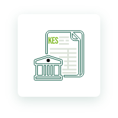
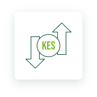
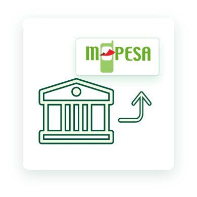

<p align="center">

</p>
<h1 align="center">Co-operative Bank of Kenya Golang SDK</h3>

[](https://pkg.go.dev/github.com/wondenge/coop-go?tab=doc)
[](https://goreportcard.com/report/wondenge/coop-go)
[]

# Overview

Coo-operative Bank of Kenya offers simple and RESTful APIs that allow one to quickly integrate and manage payments in web or mobile applications.

This Golang SDK provides an avenue to intergrate with the APIs directly inside your Go application to tap into the continuous innovation at the bank.

# Installation

```bash
$  go get github.com/wondenge/coop-go
```

# Usage

```go
package connectapi

import (
	"context"
	"fmt"

	"github.com/go-kit/kit/log"
	connect "github.com/wondenge/coop-go/gen/connect"
)

// connect service example implementation.
// The example methods log the requests and return zero values.
type connectsrvc struct {
	logger log.Logger
}

// NewConnect returns the connect service implementation.
func NewConnect(logger log.Logger) connect.Service {
	return &connectsrvc{logger}
}
```

<h1 align="left">Authentication</h1>

```go
func GetAccessToken(ctx context.Context, ConsumerKey, ConsumerSecret string) (*TokenResponse, error) {

	buf := bytes.NewBuffer([]byte("grant_type=client_credentials"))

	req, err := http.NewRequestWithContext(ctx, "POST", "https://developer.co-opbank.co.ke:8243/token", buf)
	if err != nil {
		return &TokenResponse{}, fmt.Errorf("could not make new http request: %w", err)
	}

	// Set Header Parameters
	req.Header.Set("Content-Type", "application/x-www-form-urlencoded")
	req.SetBasicAuth(ConsumerKey, ConsumerSecret)
	resp, err := http.DefaultClient.Do(req)
	if err != nil {
		return nil, fmt.Errorf("could not load default HTTP client: %w", err)
	}

	//  We're done reading from response body, lets close it.
	defer func() {
		err := resp.Body.Close()
		if err != nil {
			err := fmt.Errorf("could not close response body: %w", err)
			fmt.Println(err.Error())
		}
	}()

	// Read data from response body.
	body, err := ioutil.ReadAll(resp.Body)
	if err != nil {
		err := fmt.Errorf("oauth2: cannot fetch token: %v", err)
		fmt.Println(err.Error())
	}

	var token = TokenResponse{}

	// Parse the JSON-encoded data from response body.
	// The data is stored in the value pointed by response.
	if err := json.Unmarshal(body, &token); err != nil {
		err := fmt.Errorf("could not unmarshal response body: %w", err)
		fmt.Println(err.Error())
	}

	return &token, nil
}
```

<p align="left">

</p>
<h1 align="left">1. AccountBalance API</h1>
The Account Balance Enquiry API enables you to enquire about your own Co-operative Bank accounts' balance as at now for the specified account number.

```go
// Post an Account Balance Enquiry Request
func (s *connectsrvc) AccountBalance(ctx context.Context, p *connect.AccountBalancePayload) (res *connect.AccountBalanceSuccessResponse, err error) {
	res = &connect.AccountBalanceSuccessResponse{}
	s.logger.Log("info", fmt.Sprintf("connect.AccountBalance"))
	return
}
```

<p align="left">

</p>
<h2 align="left">2. AccountFullStatement API</h2>
The Account Full Statement Enquiry API enables you to enquire about your own Co-operative Bank accounts' full statement for the specified account number, start date and end date.

```go
// Post an Account Full Statement Enquiry Request
func (s *connectsrvc) AccountFullStatement(ctx context.Context, p *connect.AccountFullStatementPayload) (res *connect.AccountFullStatementSuccessResponse, err error) {
	res = &connect.AccountFullStatementSuccessResponse{}
	s.logger.Log("info", fmt.Sprintf("connect.AccountFullStatement"))
	return
}
```

<p align="left">

</p>
<h2 align="left">3. AccountMiniStatement API</h2>
The Account Mini Statement Enquiry API enables you to enquire about your own Co-operative Bank accounts' Mini statement for the specified account number.

```go
// Post an Account Mini Statement Enquiry Request
func (s *connectsrvc) AccountMiniStatement(ctx context.Context, p *connect.AccountMiniStatementPayload) (res *connect.AccountMiniStatementSuccessResponse, err error) {
	res = &connect.AccountMiniStatementSuccessResponse{}
	s.logger.Log("info", fmt.Sprintf("connect.AccountMiniStatement"))
	return
}
```

<p align="left">

</p>
<h2 align="left">4. AccountTransactions API</h2>
The Account Transactions Enquiry API enables you to enquire about your own Co-operative Bank accounts' latest transactions for the specified account number and number of transactions to be returned.

```go
// Post an Account Transactions Enquiry Request
func (s *connectsrvc) AccountTransactions(ctx context.Context, p *connect.AccountTransactionsPayload) (res *connect.AccountTransactionsSuccessResponse, err error) {
	res = &connect.AccountTransactionsSuccessResponse{}
	s.logger.Log("info", fmt.Sprintf("connect.AccountTransactions"))
	return
}
```

<p align="left">

</p>
<h2 align="left">5. AccountValidation API</h2>
The Account Validation Enquiry API enables you to validate a Co-operative Bank account number.

```go
// Post an Account Validation Enquiry Request
func (s *connectsrvc) AccountValidation(ctx context.Context, p *connect.AccountValidationPayload) (res *connect.AccountValidationSuccessResponse, err error) {
	res = &connect.AccountValidationSuccessResponse{}
	s.logger.Log("info", fmt.Sprintf("connect.AccountValidation"))
	return
}
```

<p align="left">

</p>
<h2 align="left"> 6. ExchangeRate API</h2>
The Exchange Rate Enquiry API enables you to enquire about the current SPOT exchange rate for the specified currencies.

```go
// Post an Exchange Rate Enquiry Request
func (s *connectsrvc) ExchangeRate(ctx context.Context, p *connect.ExchangeRatePayload) (res *connect.ExchangeRateSuccessResponse, err error) {
	res = &connect.ExchangeRateSuccessResponse{}
	s.logger.Log("info", fmt.Sprintf("connect.ExchangeRate"))
	return
}
```

<p align="left">

</p>
<h2 align="left">7. IFTAccountToAccount API</h2>
The Internal Funds Transfer Account to Account API enables you to transfer funds from your own Co-operative Bank account to other Co-operative Bank account(s).

```go
// Post an Internal Funds Transfer Account to Account Transaction
func (s *connectsrvc) IFTAccountToAccount(ctx context.Context, p *connect.IFTAccountToAccountTXNRequest) (res *connect.SuccessAcknowledgement, err error) {
	res = &connect.SuccessAcknowledgement{}
	s.logger.Log("info", fmt.Sprintf("connect.IFTAccountToAccount"))
	return
}
```

<p align="left">

</p>
<h2 align="left">8. INSSimulation API</h2>
The INSSimulation API gives instant notifications or alerts on account activities(Debits,Credits) to the customer so that they can reflect this in their accounting backend.

```go
// Post a Debit/Credit Account Transaction Event Type Notification Simulation
// Request
func (s *connectsrvc) INSSimulation(ctx context.Context, p *connect.INSTransactionSimulationRequest) (res *connect.SuccessAcknowledgement, err error) {
	res = &connect.SuccessAcknowledgement{}
	s.logger.Log("info", fmt.Sprintf("connect.INSSimulation"))
	return
}
```

<p align="left">

</p>
<h2 align="left">9. PesaLinkSendToAccount API</h2>
The PesaLink Send to Account Funds Transfer API enables you to transfer funds from your own Co-operative Bank account to Bank account(s) in IPSL participating banks.

```go
// Post a PesaLink Funds Transfer Send to Account Transaction
func (s *connectsrvc) PesaLinkSendToAccount(ctx context.Context, p *connect.PesaLinkSendToAccountTransactionRequest) (res *connect.SuccessAcknowledgement, err error) {
	res = &connect.SuccessAcknowledgement{}
	s.logger.Log("info", fmt.Sprintf("connect.PesaLinkSendToAccount"))
	return
}
```

<p align="left">

</p>
<h2 align="left">10. PesaLinkSendToPhone API</h2>
The PesaLink Send to Phone Funds Transfer API enables you to transfer funds from your own Co-operative Bank account to a Phone Number(s) linked to a Bank account in an IPSL participating bank.

```go
// Post a PesaLink Funds Transfer Send to Phone Transaction
func (s *connectsrvc) PesaLinkSendToPhone(ctx context.Context, p *connect.PesaLinkSendToPhoneTransactionRequest) (res *connect.SuccessAcknowledgement, err error) {
	res = &connect.SuccessAcknowledgement{}
	s.logger.Log("info", fmt.Sprintf("connect.PesaLinkSendToPhone"))
	return
}
```

<p align="left">

</p>
<h2 align="left">11. SendToM-Pesa API</h2>
The Send to M-Pesa Funds Transfer API enables you to transfer funds from your own Co-operative Bank account to an M-Pesa account recipient.

```go
// Post a Send To M-Pesa Funds Transfer Transaction
func (s *connectsrvc) SendToMPesa(ctx context.Context, p *connect.SendToMpesaTransactionRequest) (res *connect.SuccessAcknowledgement, err error) {
	res = &connect.SuccessAcknowledgement{}
	s.logger.Log("info", fmt.Sprintf("connect.SendToMPesa"))
	return
}
```

<p align="left">

</p>
<h2 align="left">12. TransactionStatus API</h2>
The Transaction Status Enquiry API enables you to enquire about the status of a previously requested transaction for the specified transaction message reference.

```go
// Post a Transaction Status Enquiry Request
func (s *connectsrvc) TransactionStatus(ctx context.Context, p *connect.FTTransactionStatusPayload) (res *connect.SuccessResponse, err error) {
	res = &connect.SuccessResponse{}
	s.logger.Log("info", fmt.Sprintf("connect.TransactionStatus"))
	return
}
```
