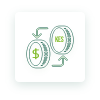

<h1 align="center">Co-operative Bank of Kenya Golang SDK</h3>

[]

# Overview

Coo-operative Bank of Kenya offers simple and RESTful APIs that allow one to quickly integrate and manage payments in web or mobile applications.

This Golang SDK provides an avenue to intergrate with the APIs directly inside your Go application to tap into the continuous innovation at the bank.

# Features

<h1 align="left">1. AccountBalance API</h1>
The Account Balance Enquiry API enables you to enquire about your own Co-operative Bank accounts' balance as at now for the specified account number.

<h2 align="left">2. AccountFullStatement API</h2>
The Account Full Statement Enquiry API enables you to enquire about your own Co-operative Bank accounts' full statement for the specified account number, start date and end date.

<h2 align="left">3. AccountMiniStatement API</h2>
The Account Mini Statement Enquiry API enables you to enquire about your own Co-operative Bank accounts' Mini statement for the specified account number.

<h2 align="left">4. AccountTransactions API</h2>
The Account Transactions Enquiry API enables you to enquire about your own Co-operative Bank accounts' latest transactions for the specified account number and number of transactions to be returned.

<h2 align="left">5. AccountValidation API</h2>
The Account Validation Enquiry API enables you to validate a Co-operative Bank account number.

<h2 align="left"> 6. ExchangeRate API</h2>
The Exchange Rate Enquiry API enables you to enquire about the current SPOT exchange rate for the specified currencies.

<h2 align="left">7. IFTAccountToAccount API</h2>
The Internal Funds Transfer Account to Account API enables you to transfer funds from your own Co-operative Bank account to other Co-operative Bank account(s).

<h2 align="left">8. INSSimulation API</h2>
The INSSimulation API gives instant notifications or alerts on account activities(Debits,Credits) to the customer so that they can reflect this in their accounting backend.

<h2 align="left">9. PesaLinkSendToAccount API</h2>
The PesaLink Send to Account Funds Transfer API enables you to transfer funds from your own Co-operative Bank account to Bank account(s) in IPSL participating banks.

<h2 align="left">10. PesaLinkSendToPhone API</h2>
The PesaLink Send to Phone Funds Transfer API enables you to transfer funds from your own Co-operative Bank account to a Phone Number(s) linked to a Bank account in an IPSL participating bank.

<h2 align="left">11. SendToM-Pesa API</h2>
The Send to M-Pesa Funds Transfer API enables you to transfer funds from your own Co-operative Bank account to an M-Pesa account recipient.

<h2 align="left">12. TransactionStatus API</h2>
The Transaction Status Enquiry API enables you to enquire about the status of a previously requested transaction for the specified transaction message reference.
